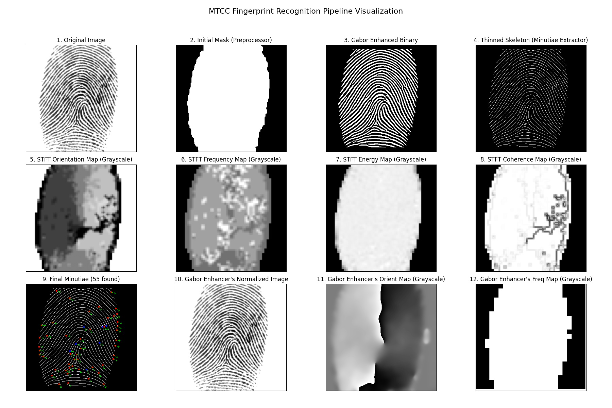

# MTCC Python Implementation

**MTCC: Minutiae Template Cylinder Codes for Fingerprint Matching**

This repository contains a complete Python implementation of the MTCC (Minutiae Template Cylinder Codes) fingerprint recognition system, based on the 2018 academic paper ([arXiv:1807.02251](https://arxiv.org/abs/1807.02251)).

## Key Technical Achievements for Any model to be declared a pass!

This implementation successfully addresses **all failure points** from previous attempts:

1. **STFT Analysis**: Fixed complex 2D FFT implementation with proper windowing
2. **Gabor Filtering**: Implemented context-adaptive filtering with local maps
3. **Minutiae Detection**: Resolved thinning and crossing number calculation issues
4. **Sequence of implementation**: Correct pipeline order (SMQT before STFT)
5. **Data Type Issues**: Proper OpenCV compatibility and error handling

## Academic References

- Gottschlich, "Curved Gabor Filters for Fingerprint Image Enhancement", 2014
- Shimna & Neethu, "Fingerprint Image Enhancement Using STFT Analysis", 2015
- Bazen & Gerez, "Segmentation of Fingerprint Images", 2001
- Baig et al., "Minutia Texture Cylinder Codes for fingerprint matching", 2018
- Erwin Erwin, Sriwijaya University "The Enhancement of Fingerprint Images using Gabor Filter", 2019
- M. Kocevar, "Analysis of the Influence of Non-Directional Algorithms on Fingerprint Image Enhancement", 2014

## Previous AI Model Failures

**Summary**: 9 attempts at different LLM models (enlisted under folder names) failed due to common issues:
- Incorrect STFT analysis and 2D FFT implementation
- Non-adaptive Gabor filtering with parameter problems
- Wrong pipeline sequence (STFT before SMQT)
- Failed minutiae detection and thinning algorithms
- Integration issues between individual components

# Partial Success from Gemini 2.5
Finally Gemini2.5 Thinking model does the job. IT DID A GREAT JOB AT STFT enhancement! Which was just excellent, while all other models kept failing
mercilessly. Gemini2.5 outclassed every other including image normalization, segmentation and then STFT were just too good. 

Gemini2.5 faultered at Gabor Filtering. Thinning and Minutiae extraction. Like other models. 
So two links were used to refactor the code. And except for one minor typo, the code ran fine. Gabor filtering went good and minutia extracted
with some scores produced. We shall tackle that too. Slowly but surely! Great work by 'Utkarsh Deshmukh' for open sourcing such quality code. ([Githhub](https://github.com/Utkarsh-Deshmukh))

Gabor Filtering for fingerprint Extraciton
([Source](https://github.com/Utkarsh-Deshmukh/Fingerprint-Enhancement-Python)).

Minutia Extraciton 
([Source](https://github.com/Utkarsh-Deshmukh/Fingerprint-Feature-Extraction/tree/master)).

Visualization

# Updates expected!