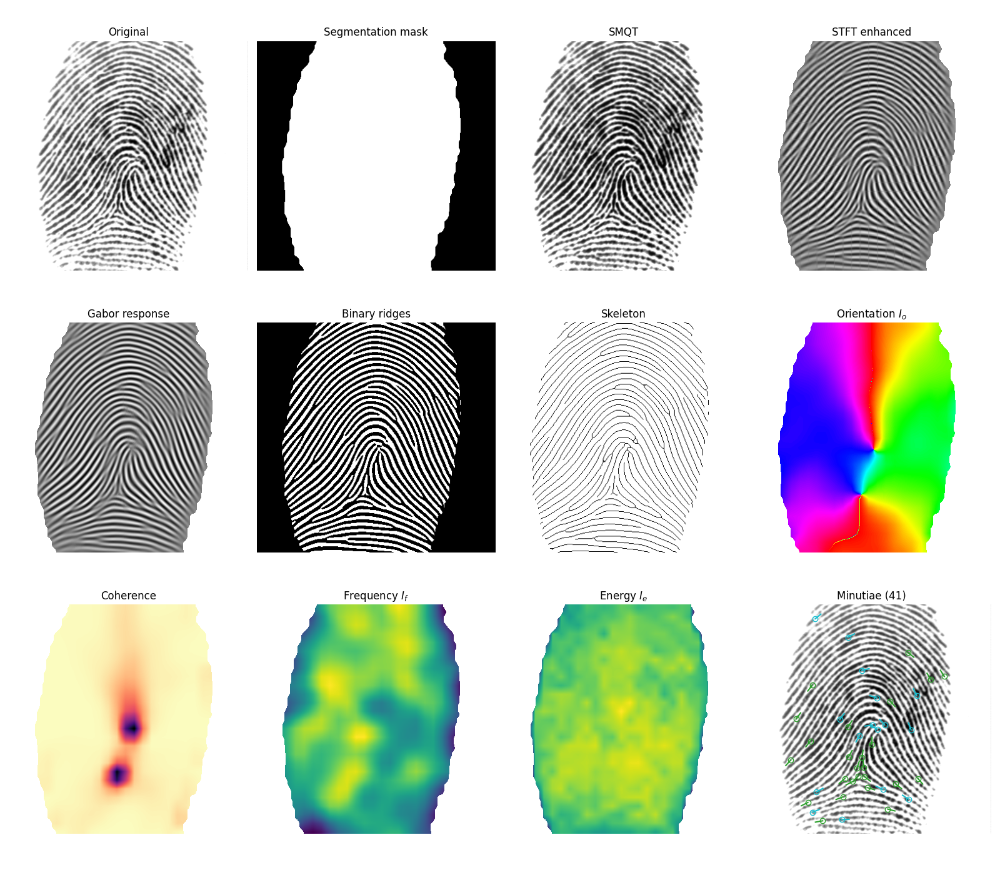

# MTCC Python Implementation

**Minutia Texture Cylinder Codes for fingerprint matching** — a clean Python implementation of
Baig et al., 2018 ([arXiv:1807.02251](https://arxiv.org/abs/1807.02251)).

MTCC extends Minutia Cylinder-Code (MCC, Cappelli et al. 2010) by replacing the minutia-angle
directional contribution of each cylinder cell with local texture: orientation, frequency and
energy from STFT analysis.



## Install

```bash
pip install -r requirements.txt
```

## Usage

```bash
# Extract a template (and optionally save the pipeline figure)
python -m mtcc extract 1_1.tif -o 1_1.npz --variant cf --plot pipeline.png

# Match two images or templates
python -m mtcc match 1_1.npz 1_2.tif --variant cf

# FVC protocol (2800 genuine / 4950 impostor) on one database, all variants
python -m mtcc evaluate FVC2002/Db1_a --jobs 8 --out db1a.json
```

From Python:

```python
from mtcc import Params, read_image, templates, match

p = Params()
a = templates(read_image('1_1.tif'), ['cf'], p)['cf']
b = templates(read_image('1_2.tif'), ['cf'], p)['cf']
print(match(a, b, p))
```

## Pipeline

| Step | Module | Notes |
|------|--------|-------|
| Segmentation | `enhance.segment` | Block-wise variance, morphological open/close, largest component |
| SMQT | `enhance.smqt` | Successive Mean Quantization Transform, 8 levels, applied before STFT |
| STFT analysis + enhancement | `enhance.stft` | 14 px blocks, 6 px overlap; spectral moments give I_o, I_f, I_e and coherence; contextual angular × radial filtering (Chikkerur et al.) |
| Gabor | `enhance.gabor` | Orientation-adaptive even Gabor at the median ridge frequency; sign gives the ridge map |
| Minutiae | `minutiae.py` | Thinning, crossing number, ridge tracing for direction, border/cluster/spur removal |
| Cylinders | `cylinder.py` | Eqs. 1–14, variants `o f e co cf ce` |
| Matching | `match.py` | Euclidean (Eq. 15) for `o`, double-angle (Eqs. 16–18) for texture; LSSR global score |
| Evaluation | `evaluate.py` | FVC protocol, EER, FMR1000 |

All parameters live in `mtcc/config.py`; cylinder and matching values are those of Table IV of the paper.

### Implementation choices where the paper is not explicit

- **Pipeline order**: SMQT → STFT → Gabor.
- **STFT window**: the 14×14 block plus 6 px overlap on each side (26 px window, 32-point FFT), following Chikkerur's STFT code.
- **I_f, I_e → [−π, π]**: per-image min-max over the foreground (1st–99th percentile).
- **G_F, G_E**: the same integrated Gaussian as G_D (σ_D).
- **Relaxation**: compatibility ρ and iteration from the MCC paper, with Table IV parameters.
- **Minutiae**: a pure-Python extractor instead of FingerJet FX OSE, so absolute EERs differ from the paper.

## Results

FVC2002 DB1_A, FVC protocol (`python -m mtcc evaluate`, default `Params`, about 4 min with 8 processes):

| Variant | EER % | FMR1000 % | Paper EER % |
|---------|------:|----------:|------------:|
| MCC_o   | 2.85 | 6.50 | 0.54 |
| MCC_f   | 2.46 | 5.57 | 0.46 |
| MCC_e   | 3.61 | 8.00 | 0.46 |
| MCC_co  | 1.43 | 3.29 | 0.42 |
| MCC_cf  | 2.29 | 5.32 | 0.42 |
| MCC_ce  | 3.25 | 7.32 | 0.50 |

As in the paper, the texture variants (except energy) beat plain MCC_o, with MCC_co best.
Absolute EERs are higher than the paper's, mainly because of the minutiae extractor (FingerJet FX OSE in the paper).

## History

`archive/` holds earlier attempts by several LLMs (June–July 2025), kept for reference.
The Gabor filtering and minutiae code in the July 2025 partial pass was refactored from
[Utkarsh Deshmukh](https://github.com/Utkarsh-Deshmukh)'s open-source repositories.

## References

- Baig et al., "Minutia Texture Cylinder Codes for fingerprint matching", 2018
- Cappelli, Ferrara, Maltoni, "Minutia Cylinder-Code: a new representation and matching technique for fingerprint recognition", PAMI 2010
- Chikkerur, Cartwright, Govindaraju, "Fingerprint enhancement using STFT analysis", Pattern Recognition 2007
- Nilsson, Dahl, Claesson, "The Successive Mean Quantization Transform", ICASSP 2005
- Bazen & Gerez, "Segmentation of Fingerprint Images", 2001
- Gottschlich, "Curved Gabor Filters for Fingerprint Image Enhancement", 2014
