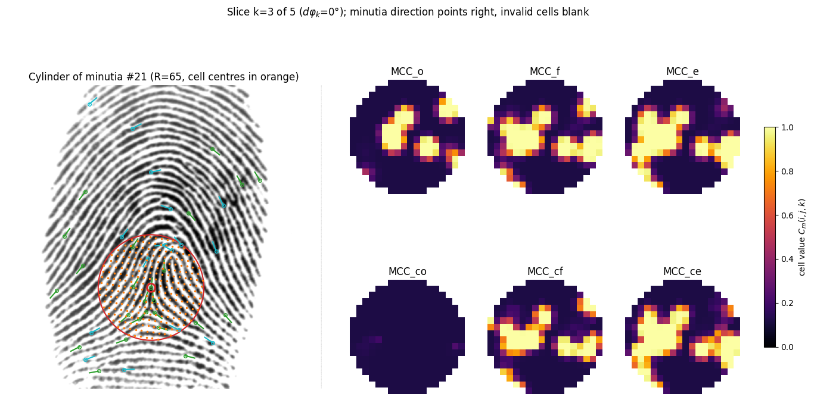

# MTCC Python Implementation

**Minutia Texture Cylinder Codes for fingerprint matching**: a clean Python implementation of
Baig et al., 2018 ([arXiv:1807.02251](https://arxiv.org/abs/1807.02251)).

MTCC extends Minutia Cylinder-Code (MCC, Cappelli et al. 2010). It replaces the minutia-angle
directional contribution of each cylinder cell with local texture: orientation, frequency and
energy from STFT analysis.

> **Implemented by Claude Opus 5.5** (Anthropic, via Claude Code, October 2026), working from the
> paper under the guidance of its author. Claude Opus 5.5 wrote the `mtcc/` package, ran every FVC
> benchmark below and produced the figures. Earlier attempts by other LLMs are in [`archive/`](archive/).

## Install

```bash
pip install -r requirements.txt
```

## Usage

```bash
# Extract a template; optionally save the pipeline and cylinder figures
python -m mtcc extract 1_1.tif -o 1_1.npz --variant co --plot pipeline.png --plot-cylinder cylinder.png

# Match two images or templates
python -m mtcc match 1_1.npz 1_2.tif --variant co

# FVC protocol (2800 genuine / 4950 impostor) on one database, all variants
python -m mtcc evaluate FVC2002/Db1_a --jobs 8 --out results/FVC2002_db1_a.json
```

From Python:

```python
from mtcc import Params, read_image, templates, match

p = Params()
a = templates(read_image('1_1.tif'), ['co'], p)['co']
b = templates(read_image('1_2.tif'), ['co'], p)['co']
print(match(a, b, p))
```

## Pipeline

All stages on FVC2002 DB1_A `1_1.tif`:


| Step | Module | Notes |
|------|--------|-------|
| Segmentation | `enhance.segment` | Block-wise variance, morphological open/close, largest component |
| SMQT | `enhance.smqt` | Successive Mean Quantization Transform, 8 levels, applied before STFT |
| STFT analysis + enhancement | `enhance.stft` | 14 px blocks, 6 px overlap; spectral moments give I_o, I_f, I_e and coherence; contextual angular × radial filtering (Chikkerur et al.) |
| Gabor | `enhance.gabor` | Orientation-adaptive even Gabor at the median ridge frequency; its sign gives the ridge map |
| Minutiae | `minutiae.py` | Thinning, crossing number, ridge tracing for direction, border/cluster/spur removal |
| Cylinders | `cylinder.py` | Eqs. 1–14, variants `o f e co cf ce` |
| Matching | `match.py` | Euclidean (Eq. 15) for `o`, double-angle (Eqs. 16–18) for texture; LSSR global score |
| Evaluation | `evaluate.py` | FVC protocol, EER, FMR1000 |

### MTCC cylinder

The cylinder of one minutia from the same image (left), and slice k = 3 of 5 (dφ_k = 0°) of
that cylinder for each variant (right). In each slice the minutia direction points to the right,
and invalid cells are blank.



All parameters live in `mtcc/config.py`. The cylinder and matching values are those of Table IV of the paper.

### Implementation choices where the paper is not explicit

- **Pipeline order**: SMQT → STFT → Gabor.
- **STFT window**: the 14×14 block plus 6 px overlap on each side (26 px window, 32-point FFT), following Chikkerur's STFT code.
- **I_f, I_e → [−π, π]**: per-image min-max over the foreground (1st–99th percentile).
- **G_F, G_E**: the same integrated Gaussian as G_D (σ_D).
- **Relaxation**: compatibility ρ and iteration from the MCC paper, with Table IV parameters.
- **Minutiae**: a pure-Python extractor instead of FingerJet FX OSE, so absolute EERs differ from the paper.

## Results

FVC protocol on every `_A` database: 2800 genuine and 4950 impostor comparisons each, default `Params`,
no per-database tuning. The raw numbers are in [`results/`](results/). Best variant per database in bold.

### EER (%)

| Database | MCC_o | MCC_f | MCC_e | MCC_co | MCC_cf | MCC_ce |
|----------|------:|------:|------:|-------:|-------:|-------:|
| FVC2000 DB2 | 4.82 | 4.82 | 6.10 | **1.93** | 4.54 | 5.07 |
| FVC2000 DB3 | 10.08 | 12.28 | 13.57 | **8.57** | 11.64 | 13.07 |
| FVC2000 DB4 | 8.79 | 6.50 | 6.03 | **4.08** | 6.43 | 5.75 |
| FVC2002 DB1 | 2.85 | 2.46 | 3.61 | **1.43** | 2.29 | 3.25 |
| FVC2002 DB2 | 3.25 | 3.21 | 2.79 | **2.00** | 2.99 | 2.61 |
| FVC2002 DB3 | 14.64 | 16.36 | 14.97 | **9.96** | 15.01 | 14.25 |
| FVC2002 DB4 | 7.75 | 5.61 | 4.82 | **3.43** | 5.29 | 4.75 |
| FVC2004 DB1 | 15.46 | 14.79 | 16.61 | **8.50** | 14.79 | 15.92 |
| FVC2004 DB2 | 15.43 | 18.82 | 17.72 | **9.68** | 17.78 | 17.21 |
| FVC2004 DB3 | 14.89 | 14.46 | 18.08 | **10.04** | 13.72 | 17.51 |
| FVC2004 DB4 | 10.71 | 9.21 | 7.78 | **5.29** | 8.64 | 7.57 |

### FMR1000 (% FNMR at FMR ≤ 0.1%)

| Database | MCC_o | MCC_f | MCC_e | MCC_co | MCC_cf | MCC_ce |
|----------|------:|------:|------:|-------:|-------:|-------:|
| FVC2000 DB2 | 12.04 | 9.61 | 11.11 | **5.75** | 9.07 | 10.39 |
| FVC2000 DB3 | 24.61 | 20.61 | 23.21 | **14.04** | 20.68 | 21.82 |
| FVC2000 DB4 | 22.64 | 15.43 | 11.96 | **10.32** | 14.64 | 11.93 |
| FVC2002 DB1 | 6.50 | 5.57 | 8.00 | **3.29** | 5.32 | 7.32 |
| FVC2002 DB2 | 6.07 | 6.89 | 6.07 | **3.14** | 6.25 | 5.57 |
| FVC2002 DB3 | 35.93 | 40.21 | 34.89 | **29.07** | 40.43 | 32.32 |
| FVC2002 DB4 | 19.75 | 11.96 | 12.43 | **9.04** | 12.43 | 11.18 |
| FVC2004 DB1 | 43.64 | 38.82 | 43.07 | **25.36** | 40.79 | 41.14 |
| FVC2004 DB2 | 37.39 | 38.68 | 36.71 | **22.82** | 37.75 | 33.54 |
| FVC2004 DB3 | 39.82 | 27.79 | 30.71 | **24.14** | 26.39 | 28.96 |
| FVC2004 DB4 | 30.29 | 23.43 | 20.14 | **16.04** | 26.29 | 17.68 |

### Comparison with the paper (EER %, MCC_co)

| Database | This implementation | Paper |
|----------|--------------------:|------:|
| FVC2002 DB1 | 1.43 | 0.42 |
| FVC2002 DB2 | 2.00 | 0.38 |
| FVC2002 DB3 | 9.96 | 4.42 |
| FVC2002 DB4 | 3.43 | 1.61 |
| FVC2004 DB1 | 8.50 | 3.85 |
| FVC2004 DB2 | 9.68 | 5.35 |
| FVC2004 DB3 | 10.04 | 3.78 |
| FVC2004 DB4 | 5.29 | 2.38 |

**What the results show**

- **The main finding holds.** Texture-based cylinders beat plain minutia-angle MCC (MCC_o).
  MCC_co is the best variant on all 11 databases, and it roughly halves the EER of MCC_o on the
  harder sets.
- **Absolute errors are 2–5× higher than the paper.** The gap is widest on the low-quality
  databases (FVC2002 DB3, FVC2004). The most likely cause is the minutiae extractor: the paper uses
  FingerJet FX OSE, while this code uses a simple pure-Python crossing-number extractor.
  The other variants don't follow the paper's ranking closely, which may be partly explained by
  the I_f / I_e normalisation choice above.
- **FVC2000 DB1 is not reported.** The local copy of that database is incomplete (125 of 800
  files, some of them empty).

Runtime: about 0.5 s per image for feature extraction and 3–6 ms per match on a 12-core desktop.
One database takes 4–15 minutes for all six variants.

## History

`archive/` holds earlier attempts by several LLMs (June–July 2025), kept for reference.
The Gabor filtering and minutiae code in the July 2025 partial pass was refactored from
[Utkarsh Deshmukh](https://github.com/Utkarsh-Deshmukh)'s open-source repositories.

## References

- Baig et al., "Minutia Texture Cylinder Codes for fingerprint matching", 2018
- Cappelli, Ferrara, Maltoni, "Minutia Cylinder-Code: a new representation and matching technique for fingerprint recognition", PAMI 2010
- Chikkerur, Cartwright, Govindaraju, "Fingerprint enhancement using STFT analysis", Pattern Recognition 2007
- Nilsson, Dahl, Claesson, "The Successive Mean Quantization Transform", ICASSP 2005
- Bazen & Gerez, "Segmentation of Fingerprint Images", 2001
- Gottschlich, "Curved Gabor Filters for Fingerprint Image Enhancement", 2014
